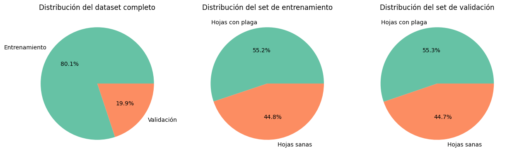
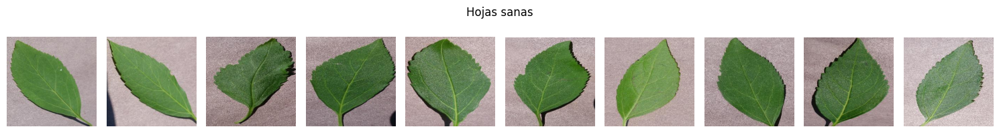
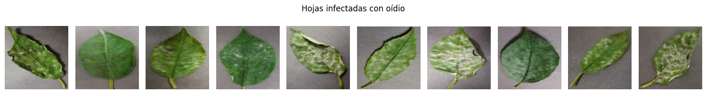

# Powdery Mildew Detection

## Índice de contenidos
- [1. Descripción del problema](#1-descripción-del-problema)

- [2. Dataset](#2-dataset)

- [3. Flujo de trabajo](#3-flujo-de-trabajo)

    - [3.1. Modelo Resnet (Sin Regularización)](#31-modelo-resnet-sin-regularización)

    - [3.2. Modelo Resnet (Regularizado)](#32-modelo-resnet-regularizado)

    - [3.3. Modelo MobileNet (Sin Regularización)](#33-modelo-mobilenet-sin-regularización)

    - [3.4. Modelo MobileNet (Regularizado)](#34-modelo-mobilenet-regularizado)

- [4. Resultados y Conclusiones](#4-resultados-y-conclusiones)


## 1. Descripción del Problema

El mercado de las cerezas es uno en los que Chile tiene mayor participación a nivel mundial, posicionándose en la actualidad como uno de los mayores exportadores de todo el mundo. Por esto mismo, el estudio y seguimiento del correcto crecimiento de las cerezas se ha vuelto clave para asegurar mejores cosechas, aumentar la producción y presentar mayores ingresos para un gran número de entidades, desde agricultores hasta grandes empresas. Es por esto que se postula el diseño de un algoritmo de detección automatizado de la enfermedad 'blanquilla' u 'oídio' en los cultivos de las cerezas, esto a través de modelos de Deep Learning basados en conjuntos de imágenes.

Esta implementación contempla desde un análisis exploratorio de datos (EDA) hasta una implementación inicial y la regularización y comparación de resultados en base a los algoritmos y técnicas probadas.

## 2. Dataset

Para realizar esta tarea, se trabajará con el dataset PlantVillage de 'spMoganty', el cual se puede obtener desde el [repositorio oficial en GitHub](https://github.com/spMohanty/PlantVillage-Dataset.git), o bien desde su página en [Kaggle](https://www.kaggle.com/datasets/mohitsingh1804/plantvillage). Este dataset contiene 38 tipos de plantas, con un total de 54305 imágenes que incluyen plantas sanas y con pestes y 14 especies de cultivos, entre los cuales se encuentran manzanos, naranjos y cerezos.

Para efectos del proyecto, los cultivos relevantes son los cerezos, que dentro del set de datos contemplan 2 carpetas principales, 'train' y 'val', para el entrenamiento y validación respectivamente. En cada uno, se encuentran 2 subcarpetas adicionales, representando los sets de fotos de hojas de cerezas sanas y que presentan la enfermedad estudiada.

En total, el dataset contiene 1906 imágenes, con 1526 y 380 imágenes de entrenamiento y validación, respectivamente, donde se encuentra un promedio de 55.3% de hojas con peste y un 44.7% restante de hojas sanas, presentando así una proporción de 80/20 de training-validation.



Cabe destacar que las imágenes están preparadas y estandarizadas para el correcto estudio, esto dado que todas comparten medidas de 256 x 256 pixeles cada una, además de compartir una fuente de iluminación similar, así como el fondo de cada una de las hojas, facilitando su procesamiento:



Asimismo, la oídia se caracteriza por la presencia de manchas claras en las hojas, haciendo que la detección se pueda apoyar en el contraste e iluminación de las imágenes que son ingresadas a cada modelo:


## Estructura del proyecto:
```
powdery_mildew_detection
├───dataset                                             # Carpeta con los datos a utilizar
│   ├───train                                           # Imágenes de entrenamiento categorizadas
│   │   ├───Cherry_(including_sour)___healthy           # Datos de hojas sanas
│   │   └───Cherry_(including_sour)___Powdery_mildew    # Datos de hojas infectadas
│   └───val                                             # Imágenes de validación categorizadas
│       ├───Cherry_(including_sour)___healthy
│       └───Cherry_(including_sour)___Powdery_mildew
├───images                                              # Imágenes de apoyo para el archivo README.md
├───models                                              # Almacenado de los pesos de cada modelo
└───model_training                                      # Modelos de trabajo (Desarrollados en Google Colab)
```

## 3. Flujo de trabajo
Para alcanzar resultados, se trabajará primero mediante el preprocesado de imágenes, a través de procesos de redimensionamiento, transformación y centrado, para poder así dejar las mismas en condiciones que faciliten el trabajo de procesado, además de trabajar en tandas de tamaño 12 para un manejo más amigable en el tiempo de procesamiento. Asimismo, se van a explorar 2 modelos distintos para medir y comparar desempeños, estos siendo ResNet50 y MobileNet, donde en cada uno además se va a observar el desempeño en casos con y sin procesos de regularización, permitiendo así medir el nivel de precisión observable en cada uno.

Ya entrando a la etapa de entrenamiento se trabajarán con 5 épocas, promediando los resultados tanto de entrenamiento como validación en cada lote generado y a través de las épocas, graficando luego la comparación entre épocas y el grado de pérdida, para finalmente medir el desempeño mediante una matriz de confusión y hacer pruebas visuales del procesamiento del modelo.

### 3.1 Modelo Resnet (Sin regularización)
Para este primer modelo, se trabajó con un proceso de preprocesado regular, basado en la transformación de las imágenes a 256 x 256 píxeles por motivos de protocolo, se obtienen los 224 píxeles centrales, y finalmente normalizando la información.
Para efectos de este caso, como optimizador se optó por utilizar el Descenso de Gradiente Estocástico (SGD) con un ritmo de aprendizaje de 0.001, esto con motivo del carácter más exacto pero tardado de ResNet, dado que si ya se conoce que este modelo posee un mayor tiempo de cómputo, se prefirió sumarle un optimizador que vaya de la mano con el mismo funcionamiento. En total, presentó un tiempo promedio de ejecución de 3 minutos, y en la matriz de riesgos entregó un nivel de precisión casi perfecto, clasificando únicamente una de las muestras de validación con plaga erróneamente como una hoja sana, alcanzando en la quinta época una pérdida de 0.07650.

### 3.2. Modelo Resnet (Regularizado)
Para realizar esta instancia del modelo ResNet, se ejecutó un mayor nivel de preprocesado para el conjunto de entrenamiento, realizando Data Augmentation, potencialmente obteniendo resultados más ajustados a la realidad y evitar así el overfitting, específicamente mediante las operaciones:
- **RandomHorizontalFlip**: Volteando la imágen horizontalmente
- **RandomRotation**: Para realizar una rotación de la imágen en un ángulo al azar.
- **ColorJitter**: Alterando los valores de colores de la imágen, incluyendo brillo, contraste y saturación.

Cabe destacar que se dejó por fuera a la operación de ‘Random Crop’, dado que la detección depende de manera vital de la visibilidad de las manchas de la plaga, por lo que si se recorta haciendo enfoque a cierta parte al azar de la imágen, se podría perder información vitalicia para la clasificación, empeorando así el modelo. 

Con un tiempo de ejecución de 8 minutos, se alcanzó en la última época una pérdida de 0.07650, y un grado de predicción perfecta, clasificando todas las imágenes de manera correcta. A nivel gráfico, la única diferencia visible es la convergencia más lenta del modelo regularizado que el primero, posiblemente debido al mayor nivel de datos a procesar.

### 3.3. Modelo MobileNet (Sin Regularización)
En este modelo, se trabajó de manera similar al funcionamiento del ResNet sin regularización, optando por el uso del optimizador Adam, esto por su rápida convergencia comparado al desempeño del SGD, llevándose de la mano con la naturaleza de menor tiempo de procesado de MobileNet, pues esta alternativa surge para observar qué tanto puede perder el modelo al sacrificar precisión por mayor velocidad de cómputo. Obtiene una duración aproximada de 1 minuto, alcanzando una pérdida de 0.009 en su quinta época.

### 3.4. Modelo MobileNet (Regularizado)
Se realizó el mismo proceso de Data Augmentation que para el caso del ResNet, obteniendo así una pérdida de 0.0033, en una duración de 12 minutos, y presentando un descenso gráfico similar a su versión sin regularización. Respecto al desempeño en la clasificación en la matriz, se obtiene un resultado perfecto.

## 4. Resultados y conclusiones

### Resumen

| **Modelo** | **Optimizador** | **Pérdida** | **Tiempo de cómputo** | 
| --- | --- | --- | --- |
| Resnet | SGD | 0.076 | 3 minutos |
| Resnet (Regularizado) | SGD | 0.081 | 8 minutos |
| `MobileNet` | `Adam` | `0.009` | `1 minuto` |
| MobileNet (Regularizado) | Adam | 0.0033 | 12 minutos | 

### 4.1 Resultados
Dados los datos obtenidos tras el estudio de los 4 modelos, se nota un considerable ganador entre los mismos, este siendo el modelo MobileNet, dado que su velocidad de cómputo compensa el menor nivel de precisión, ya que la ganancia de modelos que buscan mayor nivel de detalle tampoco se puede considerar la mayor variando en alrededor de una milésima de diferencia en la pérdida. Respecto a los resultados obtenidos en general, se puede observar que las diferencias entre modelos resultan mínimas, indicando que el modelo más simple, como lo es MobileNet, puede presentar resultados suficientemente firmes con una gran rapidez de cómputo y precisión como para tener un modelo estable, aunque los resultados obtenidos podrían deberse a que la tarea de clasificación en este caso no presentó un desafío demasiado complejo, dada que la diferencia visual se puede reducir hasta los valores de brillo de las imágenes, que es donde se encuentran los puntos, siendo estos el factor diferenciador.

Asimismo, se puede observar que para obtener un modelo lo más general posible, se puede considerar la Data Augmentation presentada en la regularización, obteniendo resultados mínimamente mayores, más no presentan un peso demasiado alto, especialmente considerando el alto nivel de cómputo que requieren. En líneas generales, se logró trabajar de manera correcta con el set de datos para obtener un alto grado de clasificación, más es relevante considerar que los datos presentados poseen condiciones muy similares inicialmente, lo cuál deja una posible ventana a explorar en las áreas de mejora.


### 4.2 Áreas de mejora
Ante la presencia de resultados tan perfectos, se plantea la posibilidad de que exista un grado de sobreajuste o de data leakage, que si bien se utilizó protocolos de Data Augmentation en 2 instancias de los modelos, no aseguran que el modelo esté a prueba de condiciones distintas de fotos, especialmente considerando que pueden darse casos donde las fotos tomadas posean grados de iluminación que no hagan destacar de manera tan clara las características manchas de las hojas que poseen la plaga. Ante esto, se pueden contemplar posibilidades como:
- Stratified K-Fold Validation, obteniendo una validación mucho más robusta del desempeño real que podrían tener los modelos
- Entrenar el modelo con fotos menos perfectas hasta cierta medida, incluyendo distintos fondos, calidades o fuentes de luz.

---
### Autores a cargo (Nombre de Usuario de GitHub)
- Alejandro Reyes (fleajrv)
- Felipe Sánchez (Felipe-SSC)